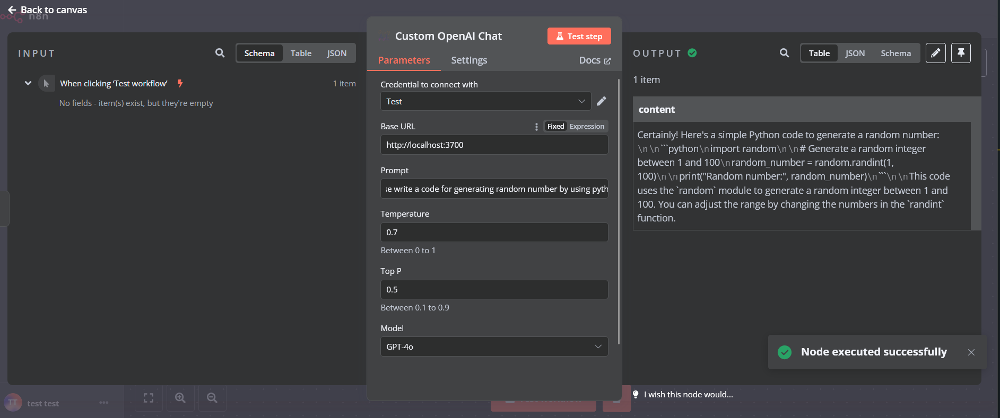
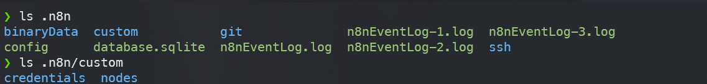

# N8N-Custom-OpenAPI-Style-AI-Chat-Node

## Purpose

Calling self-hosted OpenAI Style API. Based on [N8N node starter](https://github.com/n8n-io/n8n-nodes-starter)

## Screenshot

## Usage

### Download from release

1. Download release from release page
2. Copy `credentials` and `nodes` folder to .n8n/custom directory
     
   .n8n folder usually in home directory $HOME/.n8n
   if custom directory doesn't exist, create a new one
3. Restart n8n
4. Search `Custom OpenAI` in all nodes

### Build by yourself

This project use **pnpm** as package manager!!!

1. `git clone https://github.com/Block81838/N8N-Custom-OpenAPI-Style-API-Chat-Node.git`
2. `pnpm install`
3. `pnpm build`
4. Copy `credentials` and `nodes` folders under dist folder to .n8n/custom
